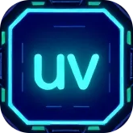

# guv — A GUI Manager for Python `uv` Virtual Environments



**guv** is a lightweight graphical interface for managing Python virtual environments created with [`uv`](https://github.com/astral-sh/uv). It lets you browse, inspect, and activate `.venv` environments from a centralized GUI.

---

## Features

- List all known `.venv` environments, tracked via `env_list`
- View:
  - Environment name and path
  - Python version
  - Creation date
  - Disk size
  - Installed packages (via `uv pip list`)
- One-click to open a terminal in the environment directory with the venv activated
- Integrates with your terminal (supports Linux GNOME-based terminals for now)

---

## Prerequisites

- Python 3.7+
- [`uv`](https://github.com/astral-sh/uv) installed globally
- Bash shell (`bash`) and `gnome-terminal` (or another compatible terminal)
- `PySide6` for the GUI

Install dependencies:

```bash
pip install PySide6
```

## Setup

Clone the repo and run the setup.py script:

```bash
python setup.py
```

This will:
- Generate a `config.py` with the absolute install path
- Create `env_list` using `get_venv.sh`
- Duplicate existing `~/.bashrc` to `~/.bashrc_uv` with `source venv/bin/activate` added at the end
- Create a `guv.desktop` launcher you can use to start the GUI, see [create launcher](https://linuxconfig.org/how-to-create-desktop-shortcut-launcher-on-ubuntu-22-04-jammy-jellyfish-linux) 
- Make sure `get_venv.sh` exists and scans for `.venv` folders to populate `env_list`.

## Usage

Run the app:

```bash
python guv.py
```

Or double-click `the guv.desktop` launcher (you may need to make it executable):

```bash
chmod +x guv.desktop
```

Once open:
- Select an environment from the list
- View detailed metadata on the right
- Click "⬛ Open Shell in Env" to launch a terminal in the environment's parent folder with the .venv activated

## Limitations

Currently supports Linux (GNOME terminal assumed)

uv must be installed globally and available in PATH

Windows/macOS support not yet implemented

## License

MIT
Credits


---
**Collaboration is more than welcome on this project!**